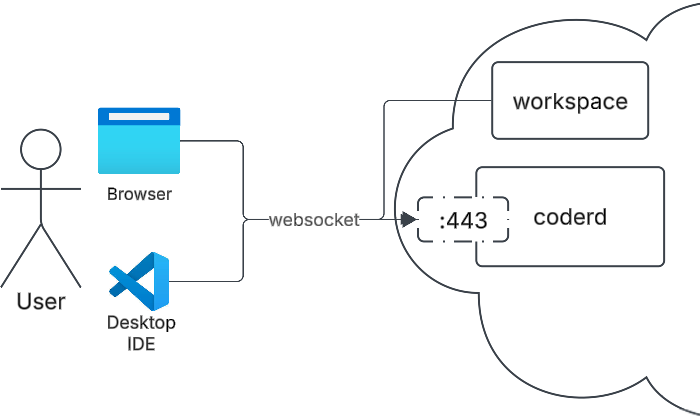
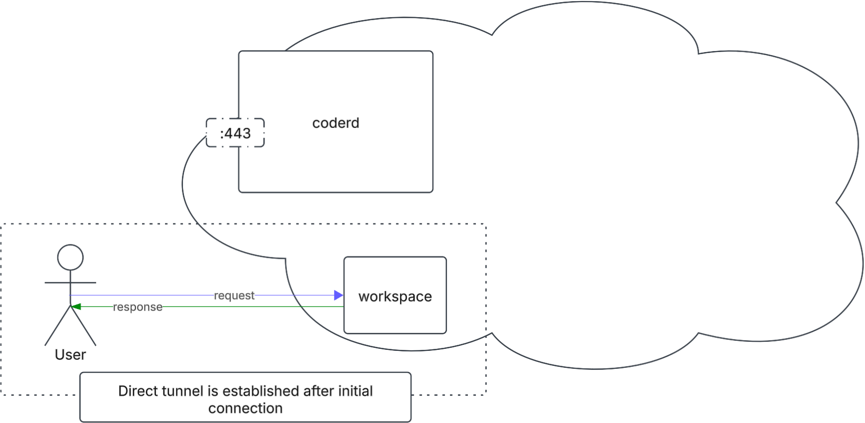
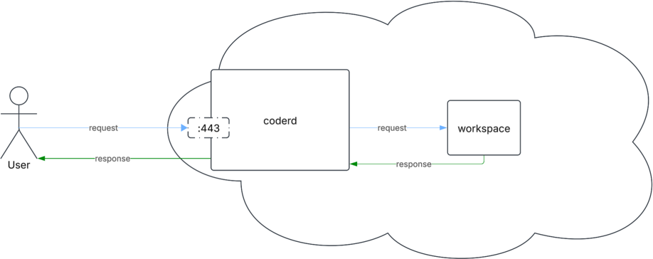
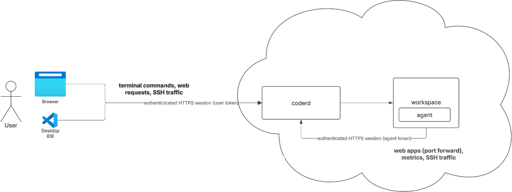

# Establishing Connections

This page explains how Coder's networking pieces work together to get a
client connected to a workspace. It's a systems-level walkthrough, not a
protocol reference: for STUN internals, see [STUN and NAT](./stun.md), and
for DERP relay configuration, see [Networking](./index.md#relayed-connections).

## The pieces

Coder establishes connections with an embedded version of
[Tailscale](https://tailscale.com)'s open source data plane. Four pieces
work together:

- **WireGuard** (via Tailscale): the encrypted tunnel that carries all
  traffic between a client and a workspace agent, whether that tunnel ends
  up direct or relayed. Every agent and client is assigned an address
  inside this tunnel from a Coder-owned IPv6 range; see
  [Coder Connect](./coder-connect.md#addressing) for details on that
  addressing when using Coder Desktop.
- **The coordinator**: runs inside coderd and exchanges WireGuard node keys
  and endpoint information between a client and an agent, so each side
  knows how to reach the other. The coordinator only exchanges this
  metadata; it never carries the tunnel's data traffic itself.
- **STUN**: helps the client and agent discover the public `ip:port` they
  can each be reached at, so they can attempt a direct connection. See
  [STUN and NAT](./stun.md) for how this works.
- **DERP**: the relay protocol used when a direct connection can't be
  established. coderd (and any [workspace proxy](./workspace-proxies.md))
  runs an embedded DERP server.

## Topology

Both the client and the workspace agent connect outbound to coderd's access
URL over an authenticated HTTPS/WebSocket session on `443`. Neither side
needs an inbound port open to the other; the coordinator inside coderd is
where they first find each other.

## Establishing a direct connection

1. The client and agent each register with the coordinator over their
   existing `443` connection to coderd.
2. The coordinator exchanges WireGuard node keys and endpoint candidates
   between them.
3. Both sides use STUN to discover a reachable `ip:port` pair (see
   [STUN and NAT](./stun.md) for the discovery and NAT traversal steps).
4. If a direct path works, the client and agent complete a WireGuard
   handshake and traffic flows peer-to-peer, without passing through
   coderd.

Use [`coder ping <workspace>`](./troubleshooting.md) to confirm whether a
connection is direct or relayed.

## Falling back to a relayed connection

If a direct path can't be established, for example because UDP is blocked
or both sides are behind restrictive NAT, the same WireGuard tunnel routes
through a DERP relay instead. By default that's coderd's embedded DERP
server, reached over the same `443` connection used for coordination.

This fallback is transparent to the user: the workspace stays reachable,
just at whatever latency the relay path adds. See
[Networking](./index.md#relayed-connections) for how to configure
Tailscale's public relays or your own custom DERP servers.

If DERP itself is unhealthy, for example a load balancer stripping the
`Upgrade: derp` header, or no DERP servers configured at all, relayed
connections fail even though the direct-connection path might otherwise
have worked. Check the
[DERP section of the health check](../monitoring/health-check.md#derp) for
deployment-wide DERP status before troubleshooting an individual
connection. coderd also exposes per-server DERP metrics (connection
counts, bytes and packets transferred, packets dropped by reason) for
Prometheus; see the
[available metrics reference](../integrations/prometheus.md#available-metrics)
for the full `coder_derp_server_*` list.

## SSH and browser sessions

Coder workspaces don't need an OpenSSH server, an open port `22`, or SSH
keys. The workspace agent runs its own in-process SSH server, and `coder
config-ssh` configures your local SSH client to reach it through a
`ProxyCommand` that shells out to the `coder` CLI. That means an SSH
session (from `coder ssh`, the VS Code or JetBrains extensions, or `ssh
coder.<workspace>`) rides over the same authenticated tunnel as everything
else, using your Coder session token, not a separate SSH credential.

Browser-based access (the web terminal, port-forwarded apps, web IDEs)
authenticates the same way, through your Coder session rather than a
separate credential.

Because every session, whether SSH or browser, is authenticated through
coderd, admins can audit who connected to a workspace and how; see
[Connection Logs](../monitoring/connection-logs.md).

## Geo-distribution and workspace proxies

Placing infrastructure closer together reduces the number of network hops
in the path above. Two rules of thumb:

- **Workspace proxies**: relay traffic to workspaces without routing
  through the primary coderd. When a proxy is in the path, total latency is
  roughly `RTT(user <-> proxy) + RTT(proxy <-> workspace)`, so keep both
  legs short by placing the proxy near both the users and the workspaces it
  serves.
- **The control plane**: coderd itself performs the same relay function as
  a workspace proxy for any traffic not served by a proxy, so the same
  RTT reasoning applies to its placement relative to workspaces. It's fine
  for coderd to sit in a different region than a given workspace as long as
  you account for that latency; the CLI tries all available proxies to pick
  the fastest one automatically.

See [Workspace Proxies](./workspace-proxies.md) for deployment details and
[Networking](./index.md#latency) for how Coder measures and reports
latency.

## Air-gapped and offline deployments

Every piece in this model works without outbound internet access. The
coordinator, STUN, and DERP all run inside your deployment (coderd and any
workspace proxies), so nothing here requires reaching the public internet.
For a fully air-gapped deployment:

- Disable STUN with `CODER_DERP_SERVER_STUN_ADDRESSES=disable`, since the
  default configuration points at Google's public STUN servers. Direct
  connections between peers on the same private network still work without
  STUN; peers that would otherwise need STUN to traverse NAT fall back to
  DERP.
- Optionally force all connections through DERP with
  `CODER_BLOCK_DIRECT=true`, so you don't depend on UDP reachability
  between clients and agents at all.
- Use coderd's built-in DERP server (the default) or your own [custom DERP
  server](./index.md#custom-relays); Tailscale's public DERP relays require
  internet access and aren't an option in an air-gapped deployment.

See [Air-gapped Deployments](../../install/airgap.md) for the full
configuration reference, including these settings for Docker Compose and
Helm.

## Up next

- Learn about [Network Requirements](./requirements.md)
- Learn about [Workspace Proxies](./workspace-proxies.md)
- Troubleshoot [Networking Issues](./troubleshooting.md)
